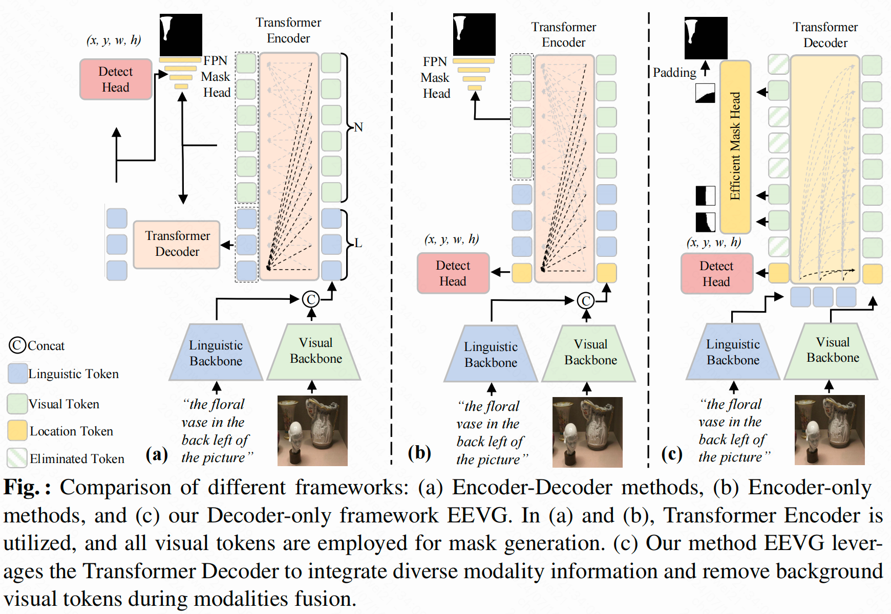

# An Efficient and Effective Transformer Decoder-Based Framework for Multi-Task Visual Grounding




### Dependencies

- Python 3.8
- Pytorch 2.0.1 + cu117
- Check [requirements.txt](requirements.txt) for other dependencies.


### Data Preparation
1.You can download the images from the original source and place them in `./ln_data` folder:
- RefCOCO/RefCOCO+/RefCOCOg
- Flickr30K Entities
- Visual Genome

Finally, the `./data/image_data` folder will have the following structure:

```angular2html
|-- ln_data
   |-- flickr30k
   |-- other/images/mscoco/images/train2014/
   |-- visual-genome
```

2.Download data labels [here](https://hkustconnect-my.sharepoint.com/:u:/g/personal/wchendb_connect_ust_hk/EbiPljj4dx5Ns-tAf3zR8_UBxiuM7kRh2VHKPoI6q58TcQ?e=WleUng) and place them in `./mask_data` folder


### Pretrained Checkpoints
Download the following checkpoints and place them in the `./checkpoints` folder.
- [ViTDet](https://dl.fbaipublicfiles.com/detectron2/ViTDet/COCO/cascade_mask_rcnn_vitdet_b/f325358525/model_final_435fa9.pkl)

- [SwinT](https://github.com/SwinTransformer/storage/releases/download/v1.0.0/swin_base_patch4_window12_384_22k.pth)

  


### Training and Evaluation

1.  Training on RefCOCOg. 
    ```
     CUDA_VISIBLE_DEVICES=0,1,2,3 python -m torch.distributed.launch --nproc_per_node=4 \
    --master_port 12345 \
     --use_env train.py \
     --batch_size 20 \
     --lr 0.000025 \
     --lr_bert 0.000005 \
     --lr_visual 0.00001 \
     --aug_scale --aug_translate --aug_crop \
     --backbone ViTDet \
     --imsize 448 \
     --bert_enc_num 12\
     --dataset gref_umd \
     --max_query_len 40 \
     --lr_scheduler poly \
     --is_segment \
     --is_eliminate \
     --vl_enc_layers 3 \
     --dim_feedforward 1024 \
     --loss_alpha 0.1 \
     --epochs 150 \
     --output_dir outputs/refcocog_ViTDet >refcocog_ViTDet.txt 2>&1 &
    ```
    Please refer to [train.sh](train.sh) for training commands on other datasets. 

2.  Evaluation on RefCOCOg.
    ```
    CUDA_VISIBLE_DEVICES=0,1,2,3 python -m torch.distributed.launch --nproc_per_node=4 \
    --master_port 12345 --use_env eval.py \
    --batch_size 20 --num_workers 10 \
    --bert_enc_num 12 \
    --backbone ViTDet --imsize 448 \
    --dataset gref_umd --max_query_len 40 \
    --eval_set test  --vl_enc_layers 3 \
    --dim_feedforward 1024 \
    --eval_model ./outputs/refcocog_ViTDet/best_mask_checkpoint.pth \
    --output_dir ./outputs/refcocog_ViTDet \
    --is_segment --is_eliminate
    ```
    Please refer to [test.sh](test.sh) for evaluation commands on other splits or datasets.

3. For the pretraining result, first use the following command to pretrain model on the mixed dataset.
    ```
    CUDA_VISIBLE_DEVICES=0,1,2,3,4,5,6,7 python -m torch.distributed.launch --nproc_per_node=8 \
     --master_port 12345 \
     --use_env train.py \
     --batch_size 20 \
     --lr 0.000025 \
     --lr_bert 0.00005 \
     --lr_visual 0.00001 \
     --aug_scale --aug_translate --aug_crop \
     --backbone ViTDet \
     --imsize 448 \
     --bert_enc_num 12 \
     --dataset mixed_pretrain \
     --max_query_len 40 \
     --vl_enc_layers 3 \
     --dim_feedforward 1024 \
     --lr_scheduler poly \
     --loss_alpha 0.5 \
     --epochs 20 \
     --output_dir outputs/mixed_pretrain_decoder >mixed_pretrain_decoder.txt 2>&1 &
    ```
    Then use the following command to fine-tune on mixed RefCOCO series datasets. 
    ```
       CUDA_VISIBLE_DEVICES=0,1,2,3,4,5,6,7 python -m torch.distributed.launch --nproc_per_node=8 \
     --master_port 12345 \
     --use_env train.py \
     --batch_size 20 \
     --is_segment \
     --lr 0.000025 \
     --lr_bert 0.000005 \
     --lr_visual 0.00001 \
     --aug_scale --aug_translate --aug_crop \
     --backbone ViTDet --is_eliminate \
     --imsize 448 \
     --bert_enc_num 12 \
     --dataset mixed_coco \
     --max_query_len 40 \
     --vl_enc_layers 3 \
     --dim_feedforward 1024 \
     --lr_scheduler poly \
     --loss_alpha 0.05 \
     --eliminated_threshold 0.0015 \
     --epochs 150 \
     --pretrain outputs/mixed_pretrain_decoder/checkpoint.pth \
     --output_dir outputs/mixed_coco_decoder >mixed_coco_decoder.txt 2>&1 &
    ```


### Our checkpoints

Our checkpoints are available at [OneDrive](https://hkustconnect-my.sharepoint.com/:f:/g/personal/wchendb_connect_ust_hk/EvQKjSt_RipOp0Xsiyso75YBUgWpIw3DQGqMaXldIb_aaQ?e=0w3oEb).
